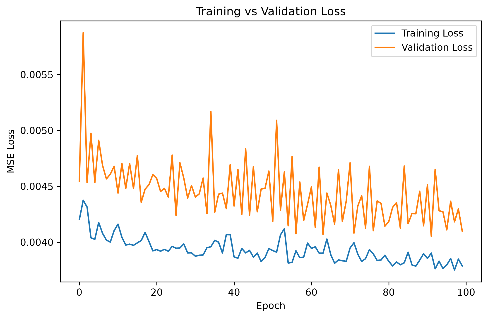
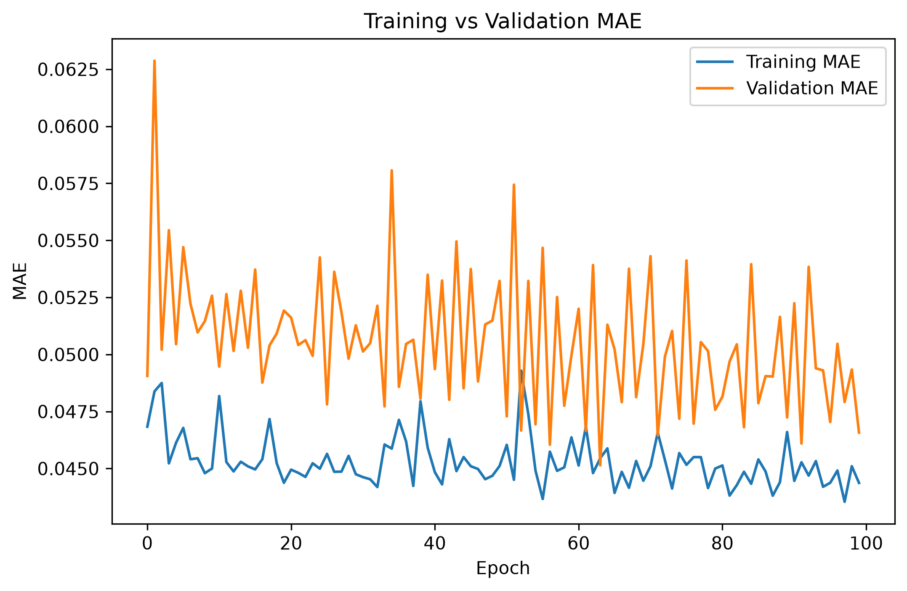
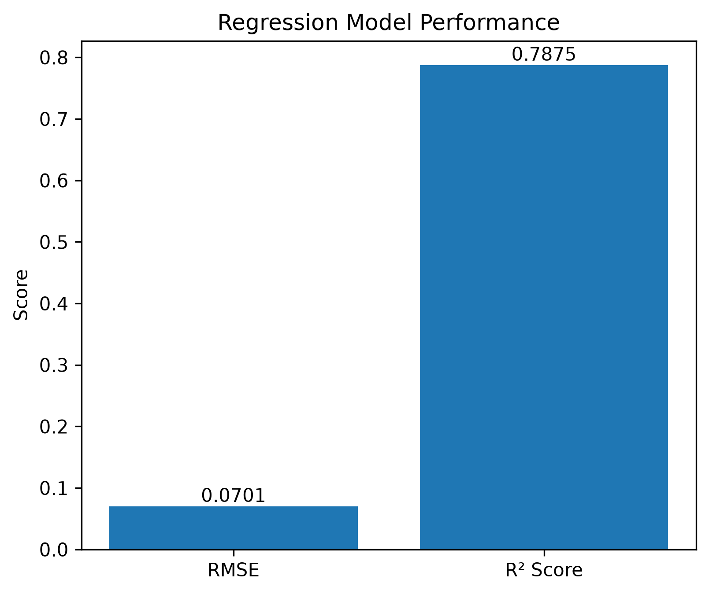
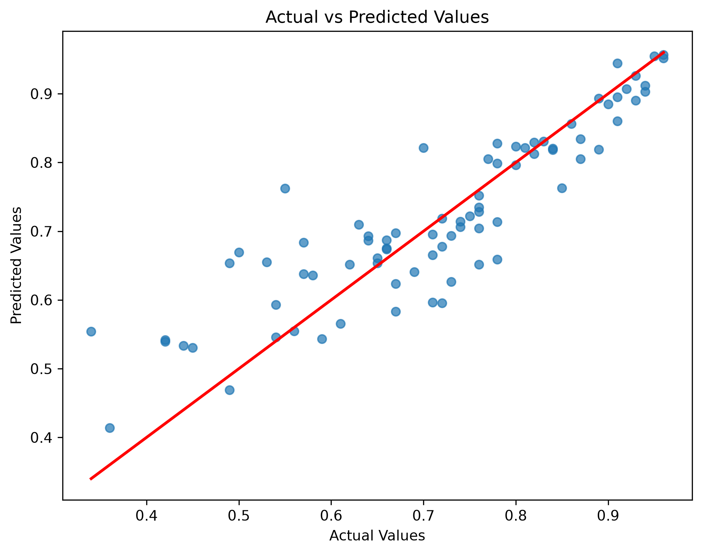

This project is for Regression Problem

# 🎓 Graduate Admission Prediction using Artificial Neural Network (ANN)

A Machine Learning regression project that predicts a student's chance of admission into graduate programs using an Artificial Neural Network (ANN) built with TensorFlow/Keras.

---

## 📌 Project Overview

This project demonstrates the complete workflow of building a regression model using Artificial Neural Networks (ANN). It includes data preprocessing, feature engineering, model training, evaluation, and visualization of model performance.

---

## 🚀 Features

- Data Cleaning
- Exploratory Data Analysis (EDA)
- Feature Engineering
- Train-Test Split
- Feature Scaling using StandardScaler
- Artificial Neural Network (ANN)
- Model Training & Validation
- Regression Evaluation
- Performance Visualization

---

## 🛠️ Tech Stack

- Python
- NumPy
- Pandas
- Matplotlib
- Seaborn
- Scikit-learn
- TensorFlow / Keras
- Jupyter Notebook

---

## 📂 Project Structure

```
Graduate_Admission_Prediction/
│
├── datasets/
│   └── Admission_Predict.csv
│
├── notebook/
│   └── Graduate_Admission_Prediction.ipynb
│
├── results/
│   ├── actual_vs_predicted.png
│   ├── loss_curve.png
│   ├── mae_curve.png
│   └── regression_metrics.png
│
├── README.md
├── requirements.txt
└── revision_notes.txt
```

---

## 📊 Data Preprocessing

- Loaded the dataset
- Checked dataset information
- Checked missing values
- Checked duplicate records
- Removed unnecessary columns (if required)
- Separated Features (X) and Target (y)
- Split dataset into Training and Testing sets
- Applied Feature Scaling using StandardScaler

---

## 🧠 ANN Model Architecture

- Input Layer
- Hidden Layer (ReLU Activation)
- Output Layer (Linear Activation)

---

## ⚙️ Model Compilation

- Optimizer: Adam
- Loss Function: Mean Squared Error (MSE)
- Metric: Mean Absolute Error (MAE)

---

## 🏋️ Model Training

The model was trained using:

- Training Dataset
- Validation Split
- Multiple Epochs

---

## 📈 Model Evaluation

Regression metrics used:

- Mean Squared Error (MSE)
- Mean Absolute Error (MAE)
- Root Mean Squared Error (RMSE)
- R² Score

---

## 📷 Results

### Loss Curve



---

### MAE Curve



---

### Regression Metrics



---

### Actual vs Predicted Values



---

## 💡 Skills Demonstrated

- Data Preprocessing
- Exploratory Data Analysis (EDA)
- Feature Engineering
- Feature Scaling
- Train-Test Split
- Artificial Neural Networks (ANN)
- TensorFlow / Keras
- Regression Modeling
- Model Training
- Model Evaluation
- Mean Squared Error (MSE)
- Mean Absolute Error (MAE)
- Root Mean Squared Error (RMSE)
- R² Score
- Data Visualization
- Git & GitHub

---

## 📌 Future Improvements

- Hyperparameter Tuning
- Dropout Regularization
- Early Stopping
- Cross Validation
- Model Deployment using Flask/FastAPI
- Docker Support

---

## 👨‍💻 Author
**Shubham Chauhan**
